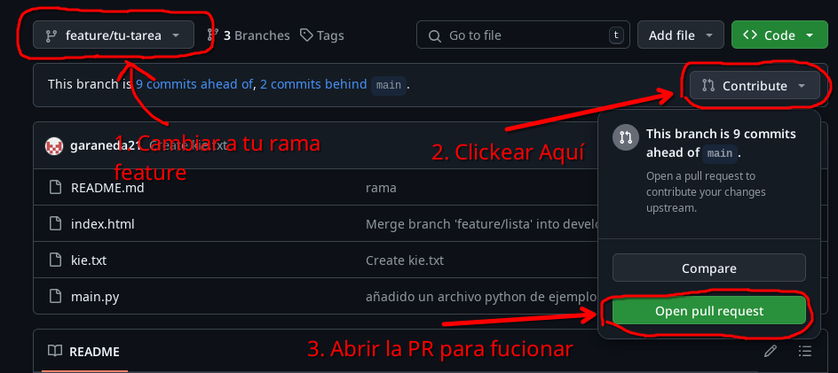
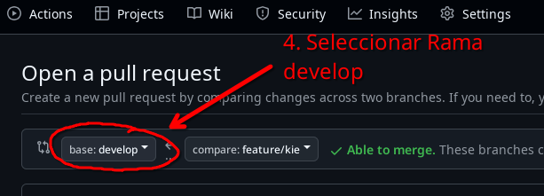

# Uso de Ramas para Repositorios

Te comparto los pasos que debe seguir un desarrollador para trabajar con el flujo de trabajo Gitflow en un proyecto, considerando posibles errores comunes como el hecho de que el repositorio local no esté actualizado.

---

### 1. Clonar el repositorio y configurar el entorno

Si el desarrollador recién se integra al proyecto, primero necesita clonar el repositorio y verificar que las ramas `main` y `develop` existen localmente.

```{bash}
# Clonar el repositorio
git clone <URL-del-repositorio>
```

Ahora puede abrir el repositorio clonando usando VSCode o otro IDE.

### 2. Confirmar las ramas remotas y verificar las ramas locales `main` y `develop` (si no existen)

Si `main` y `develop` no existen localmente, debe obtenerlas del repositorio remoto.

```{bash}
# Traer todas las ramas del repositorio remoto
git fetch --all

# Verificar las ramas locales 'main' y 'develop' a partir de las remotas si aún no están
git switch main
git pull origin main
git switch develop
git pull origin develop
```

### 3. Asegurarse de tener la última versión de `develop`

Antes de crear su nueva rama `feature`, el desarrollador debe asegurarse de que su rama `develop` está actualizada.

```{bash}
# Cambiar a la rama develop
git switch develop

# Actualizar develop con los últimos cambios del remoto
git pull origin develop
```

### 4. Crear una rama `feature` desde `develop`

El desarrollador ahora puede crear su rama `feature`. Es importante seguir una convención de nombres, como `feature/nombre-de-la-tarea` (kebab-case).

```{bash}
# Crear la rama feature desde develop
git switch -c feature/nombre-de-la-tarea develop
```

### 5. Realizar los cambios necesarios en la rama `feature` según su tarea.

El desarrollador ahora puede hacer los cambios necesarios en su código. Puede añadir, modificar o eliminar archivos según su tarea.

```{bash}
# Después de hacer los cambios, añadirlos al área de preparación (staging area)
git add .

# Confirmar los cambios
git commit -m "Descripción de los cambios realizados en la feature"
```

Para respaldar los cambios en el repositorio remoto, puede hacer `git push` en cualquier momento, y esto mantendrá la rama `feature` actualizada en el remoto sin necesidad de crear una PR/MR aún.

```{bash}
git push origin feature/nombre-de-la-tarea
```

A medida que sigue trabajando en la tarea, puede continuar haciendo commits y realizar `git push` cada vez que desee respaldar su progreso. Esto no afecta la rama `develop` ni otras ramas.

### 6. Mantener la rama `feature` sincronizada con `develop`

Mientras trabaja en su rama `feature`, puede ser que `develop` reciba nuevos cambios de otros desarrolladores. Para evitar conflictos futuros, debe sincronizar su rama `feature` con la rama `develop` antes de intentar fusionarla.

```{bash}
# Cambiar a la rama develop para asegurarse de que está actualizada
git switch develop
git pull origin develop

# Volver a la rama feature
git switch feature/nombre-de-la-tarea

# Fusionar los cambios de develop a la rama feature
git merge develop
```

Si ocurren conflictos, Git los indicará. El desarrollador debe resolver cada conflicto manualmente en los archivos afectados, luego añadir los archivos resueltos y finalizar la fusión:

```{bash}
# Añadir archivos resueltos
git add .

# Confirmar la resolución de conflictos
git commit -m "Resolver conflictos al fusionar develop en feature"
```

### 7. Subir la rama `feature` al repositorio remoto

Una vez que haya terminado su trabajo, el desarrollador debe subir la rama `feature` al remoto para crear una *pull request* (PR) o *merge request* (MR) para que otros revisen su trabajo.

```{bash}
# Subir la rama feature al repositorio remoto
git push origin feature/nombre-de-la-tarea
```

### 8. Crear una Pull Request (PR) o Merge Request (MR) para fusionar `feature` en `develop`

El desarrollador ahora puede ir a la plataforma de gestión del repositorio (GitHub, GitLab, Bitbucket, etc.) para crear la PR/MR, solicitando la fusión de su rama `feature` en `develop`.

- En GitHub, cambiar a la rama en la que estabas trabajando.

- Clickear la opcion para realizar el PR.





Ahora puede añadir los comentarios correspondientes y abrir el PR.

### 9. Asegurarse de que `develop` esté actualizado antes de la fusión final

Justo antes de que la PR/MR sea aceptada, debe verificar nuevamente que su rama `feature` esté actualizada con los últimos cambios de `develop` para evitar conflictos:

```{bash}
# Asegurarse de que develop esté actualizado
git switch develop
git pull origin develop

# Volver a la rama feature
git switch feature/nombre-de-la-tarea

# Fusionar develop en feature por última vez
git merge develop
```

### 10. Finalizar la fusión de la rama `feature` en `develop`

Una vez que se aprueba la PR/MR y se realiza la fusión en la plataforma de gestión, el desarrollador puede eliminar la rama `feature` tanto local como remotamente.

```{bash}
# Cambiar a develop para limpiar la rama feature
git switch develop

# Eliminar la rama feature localmente
git branch -d feature/nombre-de-la-tarea

# Eliminar la rama feature remotamente
git push origin --delete feature/nombre-de-la-tarea
```

